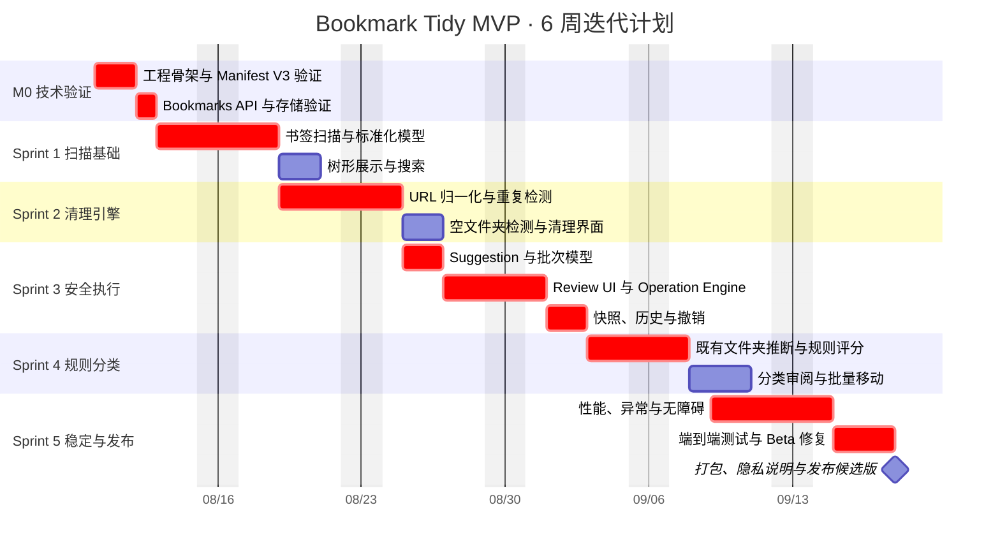

# Bookmark Tidy：MVP 迭代路线图

> 目标：在 6 周内交付一个可安装、可安全试用的 Chrome 扩展 MVP，完成“扫描 → 清理 → 分类 → 审阅 → 执行 → 撤销”的核心闭环。

| 项目项 | 计划 |
|---|---|
| 开发周期 | 2026-08-10 至 2026-09-18，共 6 周 |
| 建议团队 | 1–2 名工程师，设计与 QA 可兼职参与 |
| 技术基线 | TypeScript、React、Manifest V3、`chrome.bookmarks`、`chrome.storage` |
| 发布目标 | Chrome Web Store 内测版或可侧载的 Beta 包 |
| 核心原则 | 先分析、再预览、后执行；所有批量修改均可撤销 |

## 1. MVP 范围

### 1.1 必须交付

- 扫描并展示完整 Chrome 书签树。
- 搜索和按路径定位书签。
- URL 归一化与重复书签检测。
- 空文件夹检测。
- 基于现有文件夹、域名和关键词的规则分类。
- 分类置信度和建议原因展示。
- 统一的变更审阅页面。
- 批量移动、删除、重命名和创建文件夹。
- 操作批次、执行结果、快照和撤销。
- 基础错误处理、性能优化和发布准备。

### 1.2 本轮不包含

- AI 分类和第三方模型接入。
- 失效链接、重定向和网页元数据检查。
- 文件夹同义词合并和深层目录自动扁平化。
- Side Panel、定期扫描和新书签自动分类。
- 跨浏览器同步、移动端和多人协作。

> 将 AI 与坏链检测移出 MVP，可以先验证用户是否真正需要“安全清理 + 复用现有目录分类”这一核心价值。

## 2. 总体时间线

## 3. 里程碑与退出门槛

| 里程碑 | 时间 | 可演示成果 | 退出门槛 |
|---|---|---|---|
| M0：技术验证 | 第 1 周前半 | 扩展可加载，能读取并修改测试书签 | API、消息通道、存储和权限路径验证完成 |
| M1：只读扫描 | 第 1 周末 | Dashboard、书签树和搜索 | 对真实书签库扫描稳定，分析过程不产生写操作 |
| M2：安全清理 | 第 2 周末 | 重复项和空目录清理建议 | 相同输入产生稳定结果，用户可指定保留项 |
| M3：可撤销执行 | 第 3 周末 | Review、批量应用、历史和撤销 | 创建、移动、重命名、删除均可恢复或明确报告冲突 |
| M4：规则分类 | 第 4 周末 | 现有目录优先的分类建议 | 建议包含目标目录、置信度和命中原因 |
| M5：发布候选 | 第 6 周末 | 可侧载或提交商店的 Beta | P0/P1 缺陷清零，关键 E2E 和恢复测试通过 |

## 4. Sprint 任务拆分

### Sprint 0：技术验证（2–3 天）

**目标：** 消除 Manifest V3、书签 API 和撤销能力的关键技术风险。

| ID | 任务 | 产出 | 验收 |
|---|---|---|---|
| M0-01 | 创建 MV3 + React + TypeScript 工程骨架 | 可构建扩展包 | Chrome 开发者模式可加载，无控制台错误 |
| M0-02 | 建立 Popup、Manager 和 Service Worker 消息通道 | 页面通信原型 | Manager 可请求并收到书签树 |
| M0-03 | 封装 Bookmarks Adapter | `getTree/create/move/update/remove` 接口 | 使用测试目录完成完整 CRUD |
| M0-04 | 验证 `chrome.storage` 容量与序列化策略 | 存储实验记录 | 能保存设置和小型操作批次 |
| M0-05 | 制作最小撤销实验 | 移动/删除恢复原型 | 删除后的节点可从快照重建 |

**Gate 0：** 如果删除恢复、Service Worker 生命周期或存储规模不可接受，先调整快照策略，再进入正式开发。

### Sprint 1：扫描、模型与浏览（第 1 周）

**目标：** 建立稳定的只读书签数据层。

| ID | 任务 | 依赖 | 验收 |
|---|---|---|---|
| S1-01 | 实现 `BookmarkScanner` | M0-03 | 能读取根节点、目录和书签 |
| S1-02 | 定义 `BookmarkNode` 标准化模型 | S1-01 | 保留 ID、类型、标题、URL、父级、索引、路径和日期 |
| S1-03 | 建立按 ID、URL、目录和路径的索引 | S1-02 | 后续分析不重复遍历完整树 |
| S1-04 | 实现书签树和扁平列表视图 | S1-02 | 目录可展开，书签路径可见 |
| S1-05 | 实现标题、URL、域名和路径搜索 | S1-03 | 典型查询在 5,000 条数据上无明显卡顿 |
| S1-06 | 建立 Dashboard 基础统计 | S1-02 | 展示书签数、文件夹数和最近扫描时间 |

**Gate 1：** 扫描器只能读取数据；代码评审中不得出现从扫描/分析模块调用写 API 的路径。

### Sprint 2：确定性清理（第 2 周）

**目标：** 交付第一个真正可用的清理功能。

| ID | 任务 | 依赖 | 验收 |
|---|---|---|---|
| S2-01 | 实现 URL 归一化函数 | S1-02 | 覆盖大小写、末尾斜杠、默认端口和跟踪参数测试集 |
| S2-02 | 实现精确重复检测 | S2-01 | 相同原始 URL 正确分组 |
| S2-03 | 实现标准化重复检测 | S2-01 | 归一化 URL 相同的书签进入同组，并显示差异 |
| S2-04 | 实现保留项推荐 | S2-02 | 推荐依据可解释，用户可覆盖选择 |
| S2-05 | 实现空文件夹检测 | S1-02 | 不返回根节点、受保护目录或非空目录 |
| S2-06 | 构建 Clean 页面 | S2-02、S2-05 | 支持分组、筛选、选择和问题计数 |
| S2-07 | 建立归一化回归样本 | S2-01 | 高风险查询参数不会被盲目移除 |

**Gate 2：** 清理引擎只输出 `Suggestion[]`；任何疑似内容重复项默认不选中删除。

### Sprint 3：审阅、批次执行与撤销（第 3 周）

**目标：** 形成安全闭环，是 MVP 的最高优先级里程碑。

| ID | 任务 | 依赖 | 验收 |
|---|---|---|---|
| S3-01 | 定义 `Suggestion`、`Operation`、`OperationBatch` | S2 | DTO 可覆盖创建、移动、更新和删除 |
| S3-02 | 构建 Review UI | S3-01 | 显示前后状态、原因和依赖，可取消单项 |
| S3-03 | 实现执行前重验证 | S3-01 | 节点丢失或位置改变时报告冲突，不盲目执行 |
| S3-04 | 实现 Operation Engine | S3-03 | 按“创建 → 移动/更新 → 删除”顺序执行 |
| S3-05 | 实现执行结果与部分失败处理 | S3-04 | 每项记录成功、失败、跳过和错误原因 |
| S3-06 | 实现快照和历史记录 | S3-04 | 批次包含完整 `before/after` 数据 |
| S3-07 | 实现 Undo Engine | S3-06 | 移动、更新、创建和删除均有反向操作 |
| S3-08 | 实现撤销冲突处理 | S3-07 | 原目录不存在时给出安全恢复位置或阻止执行 |

**Gate 3：** 在准备好的破坏性测试库中连续执行“批量清理 → 撤销”，书签数量、路径和顺序恢复到可接受状态。

### Sprint 4：规则分类（第 4 周）

**目标：** 验证核心差异化——使用用户现有的目录体系整理书签。

| ID | 任务 | 依赖 | 验收 |
|---|---|---|---|
| S4-01 | 提取现有文件夹特征 | S1-02 | 建立目录名、路径和内容关键词画像 |
| S4-02 | 建立域名/关键词规则格式 | S4-01 | 规则可配置、可测试、可说明命中原因 |
| S4-03 | 实现分类评分器 | S4-02 | 输出候选目录、0–1 置信度和原因 |
| S4-04 | 实现阈值策略 | S4-03 | ≥0.90 可批量选择，低置信度默认不选 |
| S4-05 | 构建 Categorize 页面 | S4-03 | 接受、改分类、忽略和筛选均可用 |
| S4-06 | 连接批量移动与撤销 | S3-07、S4-05 | 分类执行复用 Operation Engine，不建立第二套写逻辑 |
| S4-07 | 建立匿名分类测试集 | S4-03 | 覆盖开发、AI、新闻、购物等典型目录 |

**Gate 4：** 规则分类始终优先现有目录；MVP 不自动创建大量新目录。

### Sprint 5：稳定化与 Beta（第 5–6 周）

**目标：** 将功能原型提升为可交付版本。

| ID | 任务 | 重点验收 |
|---|---|---|
| S5-01 | 大书签库性能优化 | 5,000 条扫描和列表操作无长时间主线程阻塞 |
| S5-02 | Service Worker 生命周期恢复 | 页面关闭或 Worker 重启后，未完成状态可识别 |
| S5-03 | 权限拒绝和 API 错误处理 | 用户得到明确提示，基础只读功能不崩溃 |
| S5-04 | 键盘与无障碍检查 | Review 和批量操作可键盘完成，焦点清晰 |
| S5-05 | E2E 关键路径 | 扫描、清理、分类、应用、撤销全流程通过 |
| S5-06 | 并发修改测试 | 执行前手动移动/删除节点时能检测冲突 |
| S5-07 | 隐私与数据说明 | 清楚说明读取、存储和不上传的数据范围 |
| S5-08 | 打包和发布材料 | 图标、截图、商店文案、版本号和变更日志完成 |
| S5-09 | Beta 反馈与修复 | P0/P1 清零，P2 有明确延期记录 |

**Gate 5：** 发布候选版必须通过安全恢复测试；如果撤销仍存在数据丢失风险，则延期发布而不是隐藏该功能问题。

## 5. 依赖关系

关键路径为：**技术验证 → 标准化模型 → 清理建议 → 审阅 → 执行 → 快照 → 撤销 → Beta**。分类可以在标准化模型完成后并行开发，但必须复用同一套审阅和执行机制。

## 6. 测试策略

| 测试层级 | 必测内容 | 完成标准 |
|---|---|---|
| 单元测试 | URL 归一化、重复分组、目录推断、评分、操作排序、反向操作 | 核心纯函数和高风险边界均有回归用例 |
| 属性/模糊测试 | 随机 URL、随机书签树、异常字符和超深路径 | 不崩溃、不跨域错误归一化 |
| 集成测试 | 模拟 `chrome.bookmarks`、权限拒绝、节点变化、部分失败 | 写入行为和错误结果可预测 |
| 端到端测试 | 扫描 → Clean/Categorize → Review → Apply → Undo | 三组不同规模测试库全部通过 |
| 人工安全测试 | 大批量删除、执行中关页、外部并发修改、撤销冲突 | 无静默数据丢失，失败均有明确说明 |

### 建议测试书签库

- **Small：** 50 条书签、10 个文件夹，用于快速回归。
- **Medium：** 500 条书签、50 个文件夹，包含重复项、空目录和多语言标题。
- **Large：** 5,000 条书签、200 个文件夹，包含深层目录和大量相似 URL。
- **Destructive：** 专门用于批量删除、移动、执行中断和撤销恢复。

## 7. MVP 发布标准

### 功能标准

- 六项核心功能全部可用：扫描、重复检测、空目录、分类建议、批量应用、撤销。
- Dashboard、Clean、Categorize 三个主页面完成。
- 所有建议均能说明原因；分类建议包含置信度。
- 所有写操作只通过 Operation Engine 执行。

### 质量标准

- P0 和 P1 缺陷为 0。
- 关键 E2E 流程全部通过。
- 5,000 条书签场景达到可接受交互性能。
- 权限拒绝、节点冲突、部分失败和 Worker 重启均有处理路径。
- 不存在已知的静默数据丢失问题。

### 发布材料

- Manifest、图标、版本号和构建产物。
- 隐私政策与权限用途说明。
- Chrome Web Store 文案和截图。
- 已知限制、恢复说明和反馈入口。
- Beta 发布检查清单与回滚方案。

## 8. 指标与反馈

MVP 阶段只收集必要且隐私友好的本地指标；如需上传遥测，必须单独征得用户同意。

| 指标 | 用途 | 目标/观察点 |
|---|---|---|
| 扫描成功率 | 判断基础稳定性 | 失败原因可定位 |
| 建议接受率 | 判断清理/分类质量 | 按建议类型观察，不设虚假目标 |
| 撤销率 | 识别误判和交互问题 | 撤销后可邀请用户提供可选反馈 |
| 批次失败率 | 判断执行引擎可靠性 | 失败必须有明确原因 |
| 高置信分类改选率 | 校准评分阈值 | 改选率高时降低自动推荐强度 |
| 完成一次完整整理的用户比例 | 验证核心闭环 | 从扫描到成功执行批次 |

## 9. 风险与缓冲

| 风险 | 预警信号 | 处理方式 |
|---|---|---|
| 撤销复杂度超预期 | 删除目录和顺序恢复持续失败 | 暂停高级删除，只支持移动到“待删除”目录 |
| URL 归一化误判 | 用户频繁取消标准化重复项 | 缩小规则范围，疑似项全部改为只提示 |
| 规则分类准确率不足 | 高置信建议被大量改选 | 调高阈值，优先输出候选而非默认选中 |
| Service Worker 状态丢失 | 执行中断后无法判断完成情况 | 每项操作前后持久化状态，支持恢复/核对 |
| 大数据量性能不足 | 5,000 条扫描或渲染明显卡顿 | 增量索引、分批分析、虚拟列表和受控并发 |
| 进度延期 | 第 3 周仍未完成可靠撤销 | 削减分类 UI 装饰和非核心统计，保留安全闭环 |

计划中预留约 20% 时间用于未知问题和 Beta 修复，不在前四周加入 AI、坏链检测等范围外功能。

## 10. 后续版本入口

MVP 达到发布标准后，再按数据和用户反馈决定优先级：

1. **V1.1：** 异常标题、坏链和重定向检测。
2. **V1.2：** AI 分类、隐私模式与新目录建议。
3. **V1.3：** 同义目录合并、深层目录优化和健康分数。
4. **V2：** Side Panel、定期扫描和新书签辅助分类。

