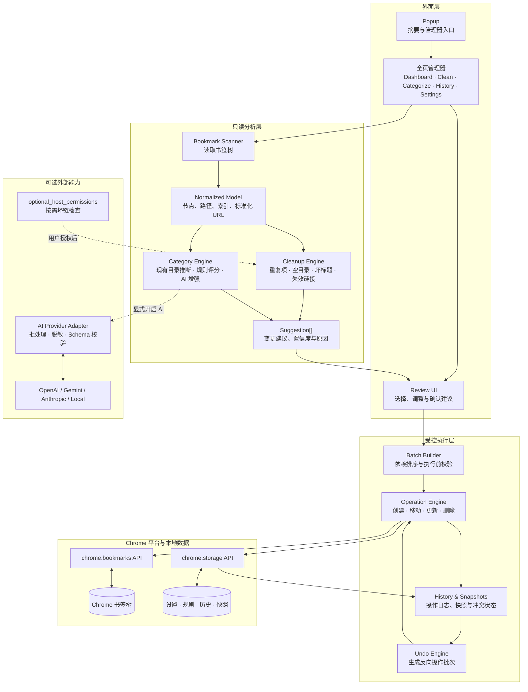

# Bookmark Tidy：Chrome 书签清理与智能分类插件

> 产品需求文档（PRD）与技术设计计划

| **版本**       | 1.0                                                    |
|----------------|--------------------------------------------------------|
| **日期**       | 2026-08-08                                             |
| **目标平台**   | Google Chrome · Manifest V3                            |
| **建议技术栈** | TypeScript · React · chrome.bookmarks · chrome.storage |
| **文档状态**   | 可用于产品评审、技术拆分与 MVP 开发启动                |

> **核心承诺：** 先分析、再预览、后执行；任何批量变更均可撤销。

> **v0.1 执行说明（2026-08-08）：** 首个可侧载版本已压缩为三天交付。本文继续描述完整产品方向；v0.1 的实际范围、日程和发布门槛以《Bookmark Tidy：3 天 MVP 迭代路线图》为准。三天版本仅实现最小扫描、重复/空目录建议、现有目录分类、统一审阅、移动/删除和最近批次撤销。

## 1. 执行摘要

Bookmark Tidy 是一款面向 Chrome 用户的“安全型书签整理器”。它读取现有书签树，识别重复项、空文件夹、异常标题、失效链接与未分类书签，再生成可审阅的清理和分类建议。只有用户明确确认后，独立的执行引擎才会修改书签。

> **产品差异化：** 优先理解并复用用户已有的文件夹结构，而不是让 AI 随机生成大量新分类。

### 1.1 产品闭环

| **阶段** | **用户看到什么** | **系统行为** | **安全控制** |
|----|----|----|----|
| Scan 扫描 | 书签数量、目录结构、健康指标 | 只读分析与标准化 | 不修改任何数据 |
| Clean 清理 | 重复项、空目录、坏标题、失效链接 | 生成清理建议 | 逐组选择保留项 |
| Categorize 分类 | 目标目录与置信度 | 规则/AI 生成分类建议 | 低置信度默认不选 |
| Review 审阅 | 变更前后对比 | 汇总操作计划 | 确认、修改或忽略 |
| Apply 执行 | 进度与结果 | 调用书签 API | 记录完整操作日志 |
| Undo 撤销 | 历史批次与快照 | 反向执行操作 | 支持恢复与冲突提示 |

### 1.2 成功标准

- 首次扫描在典型书签库（≤5,000 条）内完成，并在界面中持续显示进度。

- 所有批量修改在执行前均可预览；执行后可按批次撤销。

- 确定性清理结果可重复：相同输入产生相同建议。

- 分类优先匹配现有文件夹，只有在置信度足够高且确有必要时才建议新建文件夹。

- 默认不上传完整书签库；AI 功能为显式开启，并提供仅发送域名的隐私模式。

## 2. 产品目标、用户与边界

### 2.1 目标用户

| **用户类型** | **典型问题** | **核心价值** |
|----|----|----|
| 重度收藏者 | 数百至数千条书签，重复和层级混乱 | 批量发现问题并安全整理 |
| 知识工作者/开发者 | 主题明确但散落在多个目录 | 按既有分类归位并快速搜索 |
| 长期 Chrome 用户 | 多年积累大量失效链接和空目录 | 恢复书签库健康度 |
| 隐私敏感用户 | 不希望完整 URL 被发送到云端 | 本地规则优先、AI 可选、域名模式 |

### 2.2 产品目标

- 将书签库问题转化为清晰、可操作、可回滚的建议清单。

- 用现有文件夹推断用户的个人分类体系，降低重新学习和迁移成本。

- 把规则分类作为可靠基础，把 AI 作为可选增强，而非强依赖。

- 形成可持续维护机制：健康分数、定期扫描、新书签建议。

### 2.3 非目标（首版）

- 不替代完整的跨浏览器云端书签服务。

- 不在后台静默删除、移动或重命名任何书签。

- 不在安装时强制申请 \<all_urls\> 广泛站点权限。

- 不在 MVP 中实现自动保存网页全文、多人协作或移动端客户端。

## 3. 信息架构与关键用户流程

### 3.1 页面结构

| **页面** | **主要内容** | **主要动作** |
|----|----|----|
| Dashboard | 书签总数、文件夹数、健康分数、问题摘要 | 开始扫描、进入问题模块 |
| Clean | 重复项、空目录、异常标题、失效链接 | 筛选、选择、预览清理 |
| Categorize | 分类建议、置信度、目标文件夹 | 接受、改分类、忽略 |
| Folders | 目录结构、同义目录、深层与单项目录 | 预览合并或扁平化 |
| All Bookmarks | 树形浏览、搜索、筛选 | 定位、批量选择、手动归类 |
| History | 执行批次、快照、冲突状态 | 撤销、查看详情 |
| Settings | 规则、AI、隐私、权限、阈值 | 配置与导入/导出 |

### 3.2 主流程

1.  用户从扩展图标进入全页管理器；小弹窗仅显示摘要和“打开管理器”。

2.  点击扫描，系统读取书签树并建立标准化模型。

3.  清理引擎和分类引擎并行生成 Suggestion\[\]，但不修改书签。

4.  用户在 Review 页面逐项或批量接受建议，可调整保留项、目标文件夹和阈值。

5.  执行引擎创建操作批次与快照，按顺序调用 chrome.bookmarks API。

6.  系统显示成功、失败与跳过结果，并提供“撤销本批次”。

> **强约束：** Analysis ≠ Modification。分析器只能输出建议；任何直接写入书签的逻辑必须位于独立执行层。

## 4. 功能需求与优先级

| **模块** | **功能** | **版本** | **验收要点** |
|----|----|----|----|
| Scan | 读取并标准化书签树 | MVP | 保留 id、标题、URL、父级、索引与完整路径 |
| Clean | 精确/标准化重复检测 | MVP | 按归一化 URL 分组并允许指定保留项 |
| Clean | 空文件夹检测 | MVP | 仅在确认后删除，根目录不可删 |
| Clean | 异常标题检测与建议 | V1 | 识别 Home、Untitled、域名式标题等 |
| Clean | 失效链接与重定向检测 | V1 | 区分坏链、重定向和未知状态 |
| Categorize | 既有文件夹推断 | MVP | 现有分类优先 |
| Categorize | 域名/关键词规则与置信度 | MVP | 阈值可配置，结果可解释 |
| Categorize | AI 分类 | V1 | 批处理、隐私模式、可选提供商 |
| Organize | 批量移动/删除/重命名/建目录 | MVP | 执行前预览，部分失败可恢复 |
| Safety | 操作日志、快照与撤销 | MVP | 按批次反向执行并报告冲突 |
| Folders | 同义目录合并与层级优化 | V2 | 预览后合并，支持排除目录 |
| Maintain | 健康分数与定期检查 | V2 | 可关闭计划任务，不静默修改 |

## 5. 清理引擎设计

### 5.1 书签标准化模型

扫描器调用 chrome.bookmarks.getTree()，将 Chrome 树转换为内部模型。除展示字段外，必须保存 parentId、index、dateAdded 和路径，以支持稳定执行与撤销。

| **字段**         | **类型**           | **说明**                   |
|------------------|--------------------|----------------------------|
| id               | string             | Chrome 书签节点 ID         |
| type             | bookmark \| folder | 节点类型                   |
| title            | string             | 标题                       |
| url              | string?            | 仅书签节点存在             |
| parentId / index | string / number    | 当前位置与顺序             |
| path             | string\[\]         | 从根节点到父目录的名称路径 |
| normalizedUrl    | string?            | 用于重复检测与域名规则     |
| dateAdded        | number?            | 重复项保留策略的参考字段   |

### 5.2 URL 归一化

- 协议和主机名规范化；主机名转小写。

- 移除末尾斜杠（根路径除外）并规范默认端口。

- 移除 utm\_\*、fbclid 等已知跟踪参数；对其余参数保持稳定排序。

- 不盲目移除可能影响内容身份的查询参数、锚点或路径。

- 保存原始 URL；归一化结果只用于分析，不覆盖原值。

### 5.3 重复检测

| **类型**     | **判定方式**             | **默认建议**                   |
|--------------|--------------------------|--------------------------------|
| 精确重复     | 原始 URL 完全相同        | 保留路径最清晰或最早创建的一条 |
| 标准化重复   | normalizedUrl 相同       | 展示归一化差异，由用户确认     |
| 疑似内容重复 | 标题/域名相近但 URL 不同 | 仅提示，不自动选择删除         |

### 5.4 空目录与异常标题

- 空目录：不含书签也不含子目录；浏览器根节点与受保护目录不进入删除建议。

- 异常标题：空标题、Home、Untitled、index、New Tab、Login、纯域名等低信息标题。

- 标题建议来源按优先级为：本地规则 → 已缓存页面元数据 → 用户显式开启的在线/AI 服务。

### 5.5 失效链接

| **结果**   | **示例**                     | **处理**                   |
|------------|------------------------------|----------------------------|
| Healthy    | 200–299                      | 保持                       |
| Redirected | 301 / 302 / 307 / 308        | 建议更新为最终地址，需确认 |
| Broken     | 404 / 410 / DNS 失败         | 建议移入待处理或删除       |
| Unknown    | 403 / 429 / 超时 / 阻止 HEAD | 不得默认标记为坏链         |

权限策略：仅在用户主动运行坏链检查时申请所需 host 权限；优先 optional_host_permissions。HEAD 失败时可受控回退为轻量 GET，并限制并发、超时和重试。

## 6. 分类引擎设计

### 6.1 三层分类策略

| **层级** | **输入** | **输出** | **原则** |
|----|----|----|----|
| L1 既有目录推断 | 目录名、目录内容、路径 | 候选现有分类 | 最高优先级，尊重用户体系 |
| L2 规则引擎 | 域名、标题、URL 关键词 | 分类分数与命中依据 | 确定性、可解释、离线 |
| L3 AI 分类 | 最小化书签信息与候选目录 | 分类、置信度、新目录标记 | 显式开启、可选增强 |

### 6.2 规则评分

每条规则包含 category、domains、keywords 与权重。系统将域名命中、标题关键词、URL 路径词、相邻书签主题和现有目录相似度组合为 0–1 置信度，并返回命中依据。

| **置信度** | **默认行为**           | **界面状态**         |
|------------|------------------------|----------------------|
| ≥ 0.90     | 允许“接受全部高置信度” | 绿色，默认选中       |
| 0.80–0.89  | 建议但要求审阅         | 蓝色，默认不批量执行 |
| 0.50–0.79  | 列为候选               | 灰色，需要手动确认   |
| \< 0.50    | 不建议自动归类         | 保留在未分类         |

### 6.3 新目录策略

- 只有所有现有目录均低于匹配阈值时才考虑新目录。

- 新目录名需要经过同义词、单复数、大小写与中英文别名去重。

- 每批新建目录数量设上限；默认不自动创建层级超过两层的新目录。

- 合并 Dev / Development / Programming 等同义目录属于单独的文件夹优化建议，不与分类执行混在一起。

## 7. 审阅、执行与撤销

### 7.1 Suggestion 数据结构

| **字段** | **说明** |
|----|----|
| id / kind | 建议标识与类型：delete、move、rename、create-folder、update-url |
| targetId | 目标书签或文件夹节点 |
| before / after | 变更前后快照 |
| confidence | 0–1 置信度；确定性规则可为 1 |
| reasons | 命中规则、目录推断或 AI 解释 |
| selected | 是否进入待执行批次 |
| dependencies | 例如移动到新目录依赖 create-folder 建议 |

### 7.2 执行原则

1.  验证目标节点仍存在，并检查位置是否已被用户或其他扩展改变。

2.  创建 OperationBatch 与执行前快照。

3.  按依赖顺序执行：建目录 → 移动/重命名/更新 → 删除空目录。

4.  逐项记录成功、失败、跳过及 Chrome API 错误。

5.  遇到部分失败时不中断可安全继续的独立操作；最终给出可重试清单。

### 7.3 撤销规则

- 移动：恢复原 parentId 与 index；若原目录不存在，提示恢复目录或选择替代位置。

- 重命名/更新 URL：恢复 before 值。

- 删除书签：根据快照重新创建；新 ID 与原 ID 不同，需要更新日志映射。

- 删除目录：先重建目录，再按原顺序恢复子节点。

- 撤销也形成新批次，保留审计链，不覆盖原历史。

> **高风险检查：** 执行批量删除前，除操作日志外建议生成可导出的 HTML/JSON 快照。

## 8. 技术架构

### 8.1 总体架构图

图中的关键边界是：分析层只能输出 `Suggestion[]`，不能调用写入操作；所有书签变更必须经过 Review、批次构建和 Operation Engine，并同步写入历史与快照。

### 8.2 组件划分

| **层** | **组件** | **职责** |
|----|----|----|
| Chrome 集成 | Service Worker / Bookmarks Adapter | 封装 chrome.bookmarks、权限和事件监听 |
| 领域模型 | Scanner / Normalizer | 构建稳定内部模型与索引 |
| 分析 | DuplicateDetector / LinkChecker / Categorizer | 生成只读建议 |
| 应用 | Review UI / Batch Builder | 选择、编辑、校验待执行建议 |
| 执行 | Operation Engine | 串行/受控并发写入、重试、结果记录 |
| 存储 | Settings / History / Snapshot Store | 规则、设置、批次、快照 |
| 外部服务 | AI Provider Adapter | 批处理、限流、隐私过滤、结构化输出 |

### 8.3 数据流

Chrome Bookmarks → Scanner → Normalized Model → Cleanup Engine / Category Engine → Suggestion\[\] → Review UI → Operation Batch → Executor → chrome.bookmarks API → History & Undo。

> **边界设计：** 分析引擎不得依赖写 API；执行引擎不得自行生成建议。两者通过版本化的 Suggestion/Operation DTO 连接。

### 8.4 推荐目录结构

| **路径** | **用途** |
|----|----|
| src/background/service-worker.ts | 生命周期、消息、权限与 Chrome 事件 |
| src/pages/popup | 轻量摘要与打开管理器入口 |
| src/pages/manager | Dashboard / Clean / Categorize / History / Settings |
| src/bookmark | scanner、normalizer、duplicate-detector、link-checker、categorizer、organizer |
| src/rules/categories.ts | 内置与用户自定义分类规则 |
| src/ai | provider adapter、prompts、schema validation、privacy filter |
| src/storage | settings、history、snapshots、migration |
| src/utils | URL、hash、batch、logging 等通用能力 |

### 8.5 Manifest V3 权限

| **权限** | **阶段** | **用途 / 策略** |
|----|----|----|
| bookmarks | 安装时 | 读取、创建、移动、更新和删除书签；核心功能必需 |
| storage | 安装时 | 保存设置、规则、操作历史与轻量快照 |
| optional_host_permissions | 按需 | 坏链检查；用户触发时再申请 |
| sidePanel（可选） | V2 | 日常书签管理侧边栏 |
| alarms（可选） | V2 | 计划扫描提醒；不用于静默修改 |

## 9. AI 与隐私设计

### 9.1 AI 请求边界

- 每批 20–50 条，避免一次发送完整书签库。

- 默认只发送 title、domain、必要的 URL 片段与现有分类名称。

- 隐私模式可完全不发送完整 URL，仅发送域名和脱敏后的标题/描述。

- API Key 仅保存在本地受控存储，不写入日志、不随诊断信息导出。

- 所有模型输出经过 JSON Schema 校验；无效结果进入人工审阅，不直接执行。

### 9.2 提供商抽象

建议定义统一 AIProvider 接口，首版可接入一个提供商，后续扩展 OpenAI、Gemini、Anthropic 与本地/Ollama。接口应覆盖 classifyBatch、模型配置、速率限制、重试、超时和成本估算。

### 9.3 安全与合规

- 界面明确展示将发送哪些字段，并在首次调用前取得同意。

- AI 建议不等于用户授权；仍必须经过 Review 与 Confirm。

- 日志默认不保存完整请求/响应；调试模式应显式开启并可一键清除。

- 提供“纯本地模式”，关闭所有网络分类能力。

## 10. 非功能需求

| **维度** | **要求** |
|----|----|
| 性能 | 5,000 条书签扫描不阻塞主界面；列表使用虚拟化；坏链检查限制并发 |
| 可靠性 | 批次写入可重试；部分失败可识别；状态迁移可恢复 |
| 可测试性 | 分析器为纯函数优先；Chrome API 通过 adapter mock；URL 归一化有回归样例 |
| 可解释性 | 每个建议显示原因、规则命中和置信度 |
| 可访问性 | 键盘可操作、焦点明确、状态不只依赖颜色、表格/列表有语义标签 |
| 国际化 | 文案与规则名称可本地化；中英文目录别名可配置 |
| 可维护性 | 存储 schema 版本化；规则与 UI 解耦；操作日志支持迁移 |

## 11. 测试与验收计划

### 11.1 测试层级

| **层级**      | **重点**                                                   |
|---------------|------------------------------------------------------------|
| 单元测试      | URL 归一化、重复分组、文件夹推断、评分、依赖排序、反向操作 |
| 属性/模糊测试 | 随机 URL 与树结构不崩溃、不错误跨域归一化                  |
| 集成测试      | 模拟 chrome.bookmarks API、权限拒绝、节点变更、部分失败    |
| 端到端测试    | 扫描 → 审阅 → 执行 → 撤销完整流程                          |
| 人工安全测试  | 大批量删除、目录合并、执行中关闭页面、并发手动修改         |

### 11.2 MVP 验收清单

- 能读取并展示完整书签树，搜索结果可定位到原路径。

- 能发现精确重复与标准化重复，并让用户指定每组保留项。

- 能发现空目录，且不会误删浏览器根节点或非空目录。

- 能基于现有目录和规则生成分类建议，展示置信度与理由。

- 能在一个统一页面预览所有选中变更。

- 批次执行后显示逐项结果，并能成功撤销移动、重命名、创建和删除操作。

- 拒绝可选权限或 AI 不可用时，基础清理与规则分类仍可工作。

## 12. 迭代路线图

| **阶段** | **交付内容** | **退出标准** |
|----|----|----|
| Phase 1 基础 | MV3、React、读取/展示树、搜索、消息通道 | 稳定扫描与展示真实书签库 |
| Phase 2 Cleaner | 归一化、重复、空目录、批量选择、预览、撤销 | 形成可用的安全清理闭环 |
| Phase 3 Categorizer | 现有目录分析、规则、评分、审阅、批量移动 | 离线分类达到可接受准确率 |
| Phase 4 AI | 提供商设置、批处理、新目录建议、隐私模式 | AI 可选且不影响本地能力 |
| Phase 5 Advanced | 坏链、重定向、目录合并、层级优化、标题修复 | 复杂清理均有预览与撤销 |
| Phase 6 Maintain | 健康分数、计划扫描、Side Panel、统计 | 支持持续维护但不静默修改 |

### 12.1 建议 V1 范围

V1 只包含六项：扫描全部书签、发现重复项、发现空目录、建议分类、预览并批量应用、撤销变更。主界面仅保留 Dashboard、Clean、Categorize 三个核心页面，History 以抽屉或二级页面呈现。

### 12.2 建议开发节奏

| **里程碑**    | **建议周期** | **主要成果**                                |
|---------------|--------------|---------------------------------------------|
| M0 技术验证   | 2–3 天       | Bookmarks API、消息机制、存储与批次写入验证 |
| M1 扫描与清理 | 1–2 周       | 标准化模型、重复/空目录、基础 UI            |
| M2 安全执行   | 1 周         | Review、操作批次、日志、撤销                |
| M3 规则分类   | 1–2 周       | 既有目录推断、规则评分、批量归类            |
| M4 稳定化     | 1 周         | 性能、错误处理、权限、测试、商店材料        |

**周期**为小型团队的粗略估算，应在技术验证后根据真实书签库规模、交互复杂度和 Chrome Web Store 上架要求调整。

## 13. 风险与对策

| **风险** | **影响** | **对策** |
|----|----|----|
| 误删或误移动 | 用户信任受损、数据丢失 | 预览、快照、撤销、批次日志、默认保守选择 |
| URL 归一化过度 | 误判重复 | 保留原值、规则白名单、疑似项只提示 |
| 坏链误判 | 删除仍有效但限制访问的站点 | 403/429/超时归为 Unknown，不默认删除 |
| AI 分类不稳定 | 目录混乱、结果不可重复 | 现有目录优先、阈值、解释、Schema 校验、人工确认 |
| 权限过宽 | 安装转化与隐私信任下降 | 核心权限最小化，站点访问按需申请 |
| 大书签库性能 | 扫描和渲染卡顿 | 增量索引、Web Worker、虚拟列表、受控并发 |
| 外部并发修改 | 执行计划与真实树不一致 | 执行前重验证、版本/指纹、冲突提示 |

## 14. 关键决策记录

| **决策** | **选择** | **理由** |
|----|----|----|
| 产品定位 | 安全型整理器 | 书签是长期个人数据，信任优先于自动化程度 |
| AI 时机 | V1 增强，不作为 MVP 基础 | 先建立确定性清理和可回滚执行能力 |
| 分类策略 | 现有文件夹优先 | 尊重用户心智模型，避免目录爆炸 |
| 主界面 | 全页管理器；弹窗仅入口 | 批量审阅与树形操作需要更大空间 |
| 权限 | 最小权限 + 按需 host 权限 | 降低隐私风险和安装阻力 |
| 数据写入 | 独立 Operation Engine | 使分析可测试、执行可审计、失败可恢复 |

## 15. 下一步

1.  确认 V1 功能边界与是否包含异常标题检测。

2.  制作 3 个核心页面的低保真线框：Dashboard、Clean、Categorize。

3.  用匿名样本书签库建立 URL 归一化和分类规则测试集。

4.  完成 Manifest V3 技术验证：读树、移动、删除、创建与撤销模拟。

5.  定义 Suggestion、OperationBatch、Snapshot 的 TypeScript 接口和存储版本。

6.  进入 Phase 1 开发，并以“扫描结果完全只读”作为首个验收门槛。
